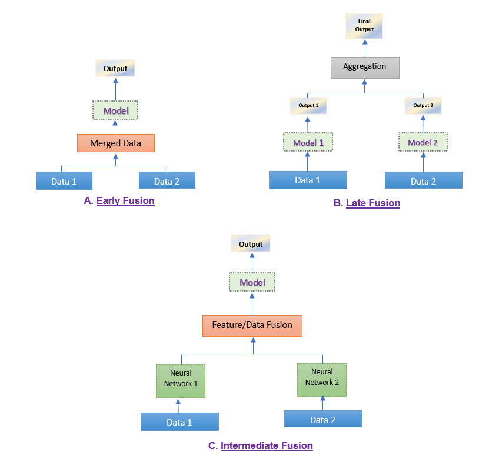

<h1 align= "center"> Fusion Optimization </h1>

## Overview

In this project, I have developed and implemented three fusion models: Early fusion, Late fusion, and Intermediate fusion. These models are designed to predict outputs from multimodal data, and I aim to compare their performance to determine which fusion strategy yields the most accurate results. A primary focus is on intermediate fusion, which often provides better results than early and late fusion. Additionally, I have applied optimization techniques, namely Brute Force, Grey Wolf Optimization (GWO), Genetic Algorithm (GA), Simulated Annealing Algorithm (SAA), and Bayesian Optimization (BO) to the intermediate fusion model to further enhance its performance.

## Installation

To start this project, clone the repository and install the necessary dependencies.
```bash
!git clone https://github.com/Damir-Kanymkulov/Fusion-Optimization
```

## Usage
Firstly, the user should load and preprocess the whole dataset with all modalities/data types. It is recommended to use CombinedData to create datasets with all modalities for early fusion, and ImageData with AttrData to create separate datasets for intermediate and late fusion. Secondly, the person takes training and validation/test sets and creates dataloaders for each set. Finally, it is necessary to collect tuples of training and validation dataloaders in a dictionary in the following format: key - "name of the data type", value - tuple(s) with (training and validation dataloaders) of the corresponding data type. Additionally, the user should create a dictionary of input dimensions for each data type in the following format: key - "name of the data type", value - input dimension of the corresponding data type.
After data loading and preprocessing, the person can send two dictionaries (1 - with data dataloaders and 2 - with input dimensions) as inputs to the **"main.py"** file and run it. The **"main.py"** file executes all the fusion functions, then calculates and compares the results.

## Fusion Models



### A. Early Fusion:
In early fusion, the data from multiple inputs is concatenated at the input level, passed through the single model, and then the output is predicted. This approach allows the model to learn from the combined data directly. 
- The **"early_fusion.py"** file has a code that performs early fusion.

### B. Late Fusion:
In late fusion, separate models are trained for each data input and the output for each model is predicted. The output of all the models is then aggregated at the decision level to calculate the final outcome. 
- The **"late_fusion.py"** file has a code that performs late fusion.

### C. Intermediate Fusion:
In intermediate fusion, features are extracted separately from each input data using specialized models. These features are then fused at an intermediate layer, and the combined features are processed jointly to make the final prediction. The loss is propagated back to the feature extracting models.
- The **"intermediate_fusion_GA.py"** file has a code that performs an intermediate fusion of two MLP models with different data types. The process of finding the best fusion location was optimized using a Genetic Algorithm (GA).
  - **Genetic algorithm (GA)** is used to find the best combination of neural network layers for two separate models that are fused together. The GA iterates through generations of candidate solutions, each representing a different configuration of the network layers. By selecting the best-performing configurations, applying crossover to combine them, and introducing mutations to explore new configurations, the GA aims to improve the model's accuracy. The fitness of each candidate solution is evaluated based on the validation loss of the fusion model, guiding the GA towards optimal layer combinations that yield better predictive performance.
    
- The **"intermediate_fusion_GWO.py"** file has a code that performs an intermediate fusion of two MLP models with different data types. The process of finding the best fusion location was optimized using Grey Wolf Optimization (GWO).
  - **Grey Wolf Optimization (GWO)** mimics the social hierarchy and hunting strategies of grey wolves to solve optimization problems. The algorithm classifies solutions into four categories: alpha, beta, delta, and omega, with alpha wolves representing the best solutions. During optimization, wolves encircle the prey (optimal solution) by updating their positions based on the leading wolves (alpha, beta, delta). This process of encircling, hunting, and attacking allows the algorithm to explore and exploit the search space efficiently to find optimal or near-optimal solutions.
    
- The **"intermediate_fusion_SAA.py"** file has a code that performs an intermediate fusion of two MLP models with different data types. The process of finding the best fusion location was optimized using a Simulated Annealing Algorithm (SAA).
   - **Simulated Annealing Algorithm (SAA)** is an optimization algorithm that mimics the annealing process in metallurgy. It starts with a solution and a high temperature that allows exploring different solutions, including worse ones, to avoid getting stuck in local optima. As it cools down, it becomes more selective, mostly accepting better solutions. The process continues until the system cools to a stopping criterion, ideally converging to a global optimum.
 
- The **"intermediate_fusion_BO.py"** file contains code that performs intermediate fusion of two MLP models with different data types. The optimal fusion location is determined using Bayesian Optimization (BO).
  - **Bayesian Optimization (BO)** is a global optimization algorithm particularly well-suited for expensive or black-box objective functions. It builds a probabilistic surrogate model—typically a Gaussian Process—that estimates the performance of different configurations. BO selects the next candidate to evaluate by balancing exploration (trying uncertain areas) and exploitation (focusing on promising regions), using an acquisition function. This iterative process continues until a stopping criterion is met, ideally converging to the best-performing configuration with fewer evaluations than traditional search methods.
     
- The **"intermediate_brute_force_search.py"** file includes a code that performs an intermediate fusion of two MLP models with different data types. The process of finding the best fusion location was done using a brute-force search algorithm.
   - **Brute Force Search** exhaustively evaluates every possible solution in the search space to find the optimal one. It systematically explores all potential configurations without employing heuristics or shortcuts. While it guarantees finding the best solution, it is computationally expensive and impractical for large or complex problems due to the sheer number of possible solutions to be examined.
